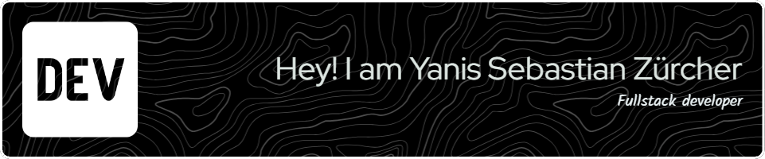

<pre>
user@lyfe:~$ ls -la

drwx------  <a href="https://sola.ysz.life">sola</a>       <a href="https://sola.ysz.life">[website]</a>   <a href="https://github.com/lyfe691/sola">[source]</a>
drwx------  <a href="https://applicare.app">applicare</a>  <a href="https://applicare.app">[website]</a>   <a href="https://github.com/lyfe691/applicare">[source]</a>
drwx------  <a href="https://thoughts.ysz.life">thoughts</a>   <a href="https://thoughts.ysz.life">[website]</a>   <a href="https://github.com/lyfe691/thoughts">[source]</a>
drwx------  <a href="https://kinoa.lol">kinoa</a>      <a href="https://kinoa.lol">[website]</a>   <a href="https://github.com/lyfe691/kinoa">[source]</a>

user@lyfe:~$ cat info.txt

<a href="https://linkedin.com/in/yanis-sebastian-zürcher">[linkedin]</a> :: <a href="mailto:yanis.sebastian.zuercher@gmail.com">[email]</a>
</pre>

<!--
OPTION 2: THE ASCII TREE (Alternative)
To use this one instead, delete the code above and uncomment this block.

<pre>
.
└── y_s_z
├── sola        ( <a href="https://sola.ysz.life">site</a> . <a href="https://github.com/lyfe691/sola">repo</a> )
├── applicare   ( <a href="https://applicare.app">site</a> . <a href="https://github.com/lyfe691/applicare">repo</a> )
├── thoughts    ( <a href="https://thoughts.ysz.life">site</a> . <a href="https://github.com/lyfe691/thoughts">repo</a> )
└── kinoa       ( <a href="https://kinoa.lol">site</a> . <a href="https://github.com/lyfe691/kinoa">repo</a> )

&gt;&gt; &lt;a href=&quot;https://linkedin.com/in/yanis-sebastian-zürcher&quot;&gt;linkedin&lt;/a&gt;
&gt;&gt; &lt;a href=&quot;mailto:yanis.sebastian.zuercher@gmail.com&quot;&gt;email&lt;/a&gt;

</pre>
-->

<!-- # Yanis Sebastian Zürcher

Currently working on:

- [**Vault**](https://github.com/lyfe691/vault) — an IAM sandbox using Keycloak, FastAPI, and Next.js  
- [**WISS Forum**](https://github.com/lyfe691/wiss-forum) — a gamified platform to motivate and connect students - specifically at the WISS

Finished projects: [sola.ysz.life/projects](https://sola.ysz.life/projects)

My goal is to work @ [**vercel**](https://vercel.com) — or build something equally focused and minimal.

[sola.ysz.life](https://sola.ysz.life) · [github.com/lyfe691](https://github.com/lyfe691)

 <!-- 

<!--

  
  
 

  
  
  
  
  

<!-- Stats Cards --

  
  

 

<!-- Tech Stack --

  

<!-- Activity Graph --

